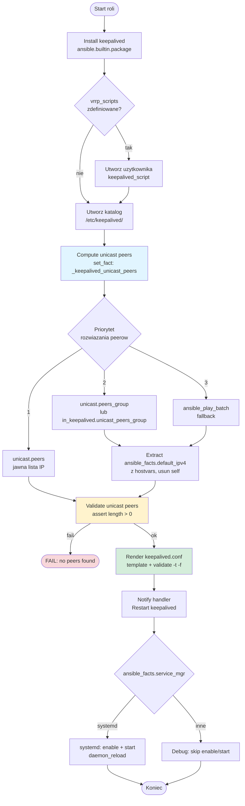
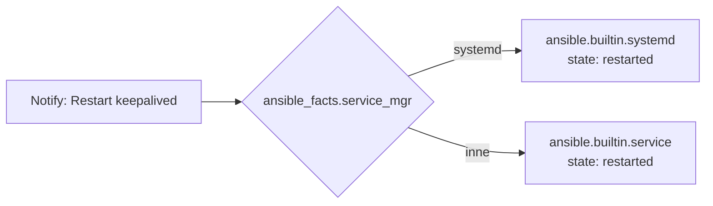

#  install-keepalived-vip

::include{file=.gitlab/badges.md}

Ansible Role konfiguracją wirtualny adresu IP (VIP).

---

## Architektura / Flow



### Handlery



## Wymagania

- Debian/Ubuntu lub RHEL/Alma/Rocky (EL)
- Uprawnienia `become: true`

## Najprostsze użycie

W playbooku:

```yaml
- role: install-keepalived-vip
  vars:
    in_keepalived:
      instances:
        - name: VI_HAPROXY
          state: BACKUP
          interface: eth0
          virtual_router_id: 51
          priority: 100
          virtual_ipaddresses:
            - "10.10.10.10/24 dev eth0"
```

## Unicast (bez multicastu)

```yaml
in_keepalived:
  instances:
    - name: VI_HAPROXY
      interface: eth0
      virtual_router_id: 51
      priority: 110
      unicast:
        enabled: true
        # Keepalived wymaga IP (hostname nie przejdzie walidacji).
        # Jeśli pominiesz `src_ip`/`peers` (albo ustawisz `peers: []`), template spróbuje
        # uzupełnić je na podstawie zebranych faktów (`ansible_facts.default_ipv4.address`)
        # z hostów w bieżącym batchu playu (ansible_play_batch). Możesz wskazać grupę:
        #   unicast.peers_group: haproxy
        # lub globalnie:
        #   in_keepalived.unicast_peers_group: haproxy
        peers: []
      virtual_ipaddresses:
        - "10.10.10.10/24 dev eth0"
```

Jeśli unicast jest włączony i nie uda się znaleźć żadnych peerów (brak `peers`,
brak hostów w `ansible_play_batch` / grupie oraz brak faktów), rola przerwie wykonanie
z czytelnym błędem.

---

## Zmienne

- `in_keepalived.instances` (list) – lista instancji VRRP (wymagana gdy enabled)
- `in_keepalived.instances[].extra_lines` – dodatkowe linie w `vrrp_instance` (np. `nopreempt`, `garp_master_delay 1`)

---

::include{file=.gitlab/footer.md}
